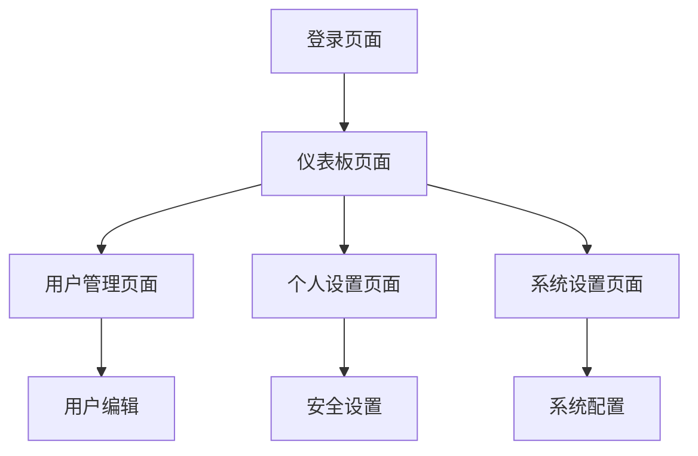

# 后台管理系统产品需求文档

## 1. Product Overview

本项目是一个基于邮箱登录的后台管理系统，为管理员提供安全的身份验证和系统管理功能。
- 解决传统用户名密码登录的安全性问题，通过邮箱验证提供更可靠的身份认证机制。
- 目标用户为企业管理员和系统运维人员，提供简洁高效的管理界面。

## 2. Core Features

### 2.1 User Roles

| Role | Registration Method | Core Permissions |
|------|---------------------|------------------|
| 管理员 | 邮箱注册 + 管理员审核 | 完整系统管理权限，用户管理，系统配置 |
| 普通用户 | 邮箱注册 | 基础查看权限，个人信息管理 |

### 2.2 Feature Module

我们的后台管理系统包含以下主要页面：
1. **登录页面**：邮箱登录表单，验证码输入，忘记密码功能。
2. **仪表板页面**：系统概览，数据统计图表，快捷操作入口。
3. **用户管理页面**：用户列表，用户信息编辑，权限管理。
4. **个人设置页面**：个人信息修改，密码修改，邮箱绑定。
5. **系统设置页面**：系统配置，邮件服务配置，安全设置。

### 2.3 Page Details

| Page Name | Module Name | Feature description |
|-----------|-------------|---------------------|
| 登录页面 | 邮箱登录表单 | 输入邮箱地址，发送验证码，验证码登录，记住登录状态 |
| 登录页面 | 忘记密码 | 通过邮箱重置密码，发送重置链接，密码强度验证 |
| 仪表板页面 | 数据概览 | 显示用户统计，系统状态，最近活动记录 |
| 仪表板页面 | 快捷操作 | 常用功能快速入口，系统通知显示 |
| 用户管理页面 | 用户列表 | 分页显示用户，搜索过滤，批量操作 |
| 用户管理页面 | 用户编辑 | 编辑用户信息，角色分配，状态管理 |
| 个人设置页面 | 个人信息 | 修改个人资料，头像上传，联系方式更新 |
| 个人设置页面 | 安全设置 | 密码修改，邮箱绑定，登录日志查看 |
| 系统设置页面 | 系统配置 | 系统参数设置，邮件服务配置，备份设置 |

## 3. Core Process

**管理员操作流程：**
1. 管理员通过邮箱接收验证码进行登录
2. 登录成功后进入仪表板查看系统概览
3. 通过用户管理页面管理系统用户
4. 在系统设置中配置系统参数
5. 通过个人设置管理自己的账户信息

**普通用户操作流程：**
1. 用户通过邮箱验证码登录系统
2. 查看仪表板中的个人数据统计
3. 在个人设置中管理个人信息
4. 查看系统通知和消息

## 4. User Interface Design

### 4.1 Design Style

- **主色调**：蓝色系 (#3B82F6) 作为主色，灰色系 (#6B7280) 作为辅助色
- **按钮样式**：圆角按钮，悬停效果，渐变背景
- **字体**：Inter 字体，标题 16-24px，正文 14px，辅助文字 12px
- **布局风格**：卡片式布局，左侧导航栏，顶部面包屑导航
- **图标风格**：使用 Heroicons 图标库，线性风格图标

### 4.2 Page Design Overview

| Page Name | Module Name | UI Elements |
|-----------|-------------|-------------|
| 登录页面 | 邮箱登录表单 | 居中卡片布局，白色背景，蓝色主按钮，输入框带图标，验证码倒计时 |
| 仪表板页面 | 数据概览 | 网格布局的统计卡片，图表组件，渐变背景，阴影效果 |
| 用户管理页面 | 用户列表 | 表格布局，搜索栏，分页组件，操作按钮组，状态标签 |
| 个人设置页面 | 个人信息 | 表单布局，头像上传区域，输入框分组，保存按钮 |
| 系统设置页面 | 系统配置 | 选项卡布局，开关组件，配置项分组，确认对话框 |

### 4.3 Responsiveness

系统采用桌面优先的响应式设计，支持平板和移动端适配，针对触摸操作进行优化，确保在不同设备上的良好用户体验。