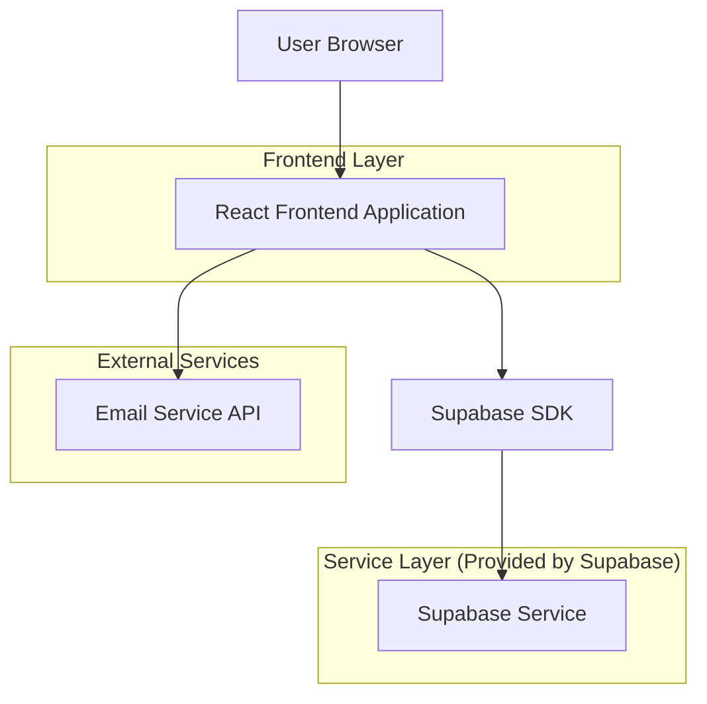
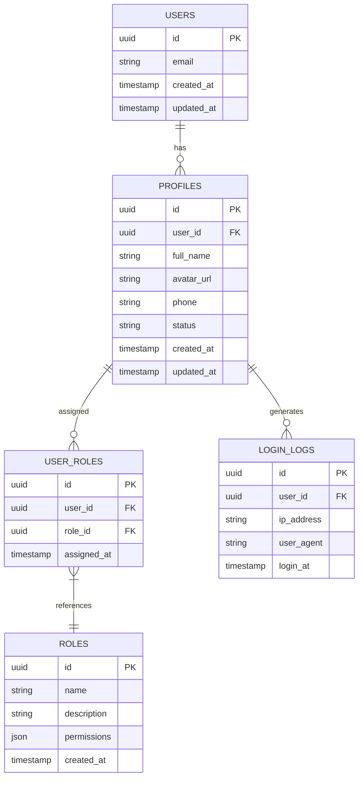

# 后台管理系统技术架构文档

## 1. Architecture design



## 2. Technology Description

* Frontend: React@19 + TypeScript@5 + TailwindCSS@3 + ahooks@3 + Vite@5

* Backend: Supabase (Authentication + Database + Storage)

* Email Service: Supabase Auth (内置邮件验证)

* State Management: ahooks (useRequest, useLocalStorageState)

* UI Components: Headless UI + Heroicons

* Form Handling: React Hook Form + Zod validation

## 3. Route definitions

| Route      | Purpose                          |
| ---------- | -------------------------------- |
| /login     | 登录页面，邮箱验证码登录         |
| /dashboard | 仪表板页面，系统概览和数据统计   |
| /users     | 用户管理页面，用户列表和管理功能 |
| /users/:id | 用户详情编辑页面                 |
| /profile   | 个人设置页面，个人信息和安全设置 |
| /settings  | 系统设置页面，系统配置管理       |
| /404       | 404错误页面                      |

## 4. API definitions

### 4.1 Core API

用户认证相关

```
POST /auth/v1/otp
```

Request:

| Param Name | Param Type | isRequired | Description                 |
| ---------- | ---------- | ---------- | --------------------------- |
| email      | string     | true       | 用户邮箱地址                |
| type       | string     | true       | 验证类型 (magiclink/signup) |

Response:

| Param Name | Param Type | Description |
| ---------- | ---------- | ----------- |
| success    | boolean    | 发送状态    |
| message    | string     | 响应消息    |

Example

```json
{
  "email": "admin@yourdomain.com",
  "type": "magiclink"
}
```

用户验证登录

```
POST /auth/v1/verify
```

Request:

| Param Name | Param Type | isRequired | Description  |
| ---------- | ---------- | ---------- | ------------ |
| email      | string     | true       | 用户邮箱地址 |
| token      | string     | true       | 验证码       |
| type       | string     | true       | 验证类型     |

Response:

| Param Name     | Param Type | Description |
| -------------- | ---------- | ----------- |
| access_token  | string     | 访问令牌    |
| refresh_token | string     | 刷新令牌    |
| user           | object     | 用户信息    |

用户管理相关

```
GET /rest/v1/profiles
```

Response:

| Param Name | Param Type | Description |
| ---------- | ---------- | ----------- |
| data       | array      | 用户列表    |
| count      | number     | 总数量      |

## 5. Data model

### 5.1 Data model definition



### 5.2 Data Definition Language

用户档案表 (profiles)

```sql
-- create table
CREATE TABLE profiles (
    id UUID PRIMARY KEY DEFAULT gen_random_uuid(),
    user_id UUID REFERENCES auth.users(id) ON DELETE CASCADE,
    full_name VARCHAR(100),
    avatar_url TEXT,
    phone VARCHAR(20),
    status VARCHAR(20) DEFAULT 'active' CHECK (status IN ('active', 'inactive', 'suspended')),
    created_at TIMESTAMP WITH TIME ZONE DEFAULT NOW(),
    updated_at TIMESTAMP WITH TIME ZONE DEFAULT NOW()
);

-- create index
CREATE INDEX idx_profiles_user_id ON profiles(user_id);
CREATE INDEX idx_profiles_status ON profiles(status);

-- RLS policies
ALTER TABLE profiles ENABLE ROW LEVEL SECURITY;

CREATE POLICY "Users can view own profile" ON profiles
    FOR SELECT USING (auth.uid() = user_id);

CREATE POLICY "Users can update own profile" ON profiles
    FOR UPDATE USING (auth.uid() = user_id);

-- Grant permissions
GRANT SELECT ON profiles TO anon;
GRANT ALL PRIVILEGES ON profiles TO authenticated;
```

角色表 (roles)

```sql
-- create table
CREATE TABLE roles (
    id UUID PRIMARY KEY DEFAULT gen_random_uuid(),
    name VARCHAR(50) UNIQUE NOT NULL,
    description TEXT,
    permissions JSONB DEFAULT '{}',
    created_at TIMESTAMP WITH TIME ZONE DEFAULT NOW()
);

-- create index
CREATE INDEX idx_roles_name ON roles(name);

-- init data
INSERT INTO roles (name, description, permissions) VALUES
('admin', '系统管理员', '{"users": ["read", "write", "delete"], "system": ["read", "write"]}'),
('user', '普通用户', '{"profile": ["read", "write"]}');

-- Grant permissions
GRANT SELECT ON roles TO anon;
GRANT ALL PRIVILEGES ON roles TO authenticated;
```

用户角色关联表 (user_roles)

```sql
-- create table
CREATE TABLE user_roles (
    id UUID PRIMARY KEY DEFAULT gen_random_uuid(),
    user_id UUID REFERENCES auth.users(id) ON DELETE CASCADE,
    role_id UUID REFERENCES roles(id) ON DELETE CASCADE,
    assigned_at TIMESTAMP WITH TIME ZONE DEFAULT NOW(),
    UNIQUE(user_id, role_id)
);

-- create index
CREATE INDEX idx_user_roles_user_id ON user_roles(user_id);
CREATE INDEX idx_user_roles_role_id ON user_roles(role_id);

-- Grant permissions
GRANT SELECT ON user_roles TO anon;
GRANT ALL PRIVILEGES ON user_roles TO authenticated;
```

登录日志表 (login_logs)

```sql
-- create table
CREATE TABLE login_logs (
    id UUID PRIMARY KEY DEFAULT gen_random_uuid(),
    user_id UUID REFERENCES auth.users(id) ON DELETE CASCADE,
    ip_address INET,
    user_agent TEXT,
    login_at TIMESTAMP WITH TIME ZONE DEFAULT NOW()
);

-- create index
CREATE INDEX idx_login_logs_user_id ON login_logs(user_id);
CREATE INDEX idx_login_logs_login_at ON login_logs(login_at DESC);

-- Grant permissions
GRANT SELECT ON login_logs TO anon;
GRANT ALL PRIVILEGES ON login_logs TO authenticated;
```