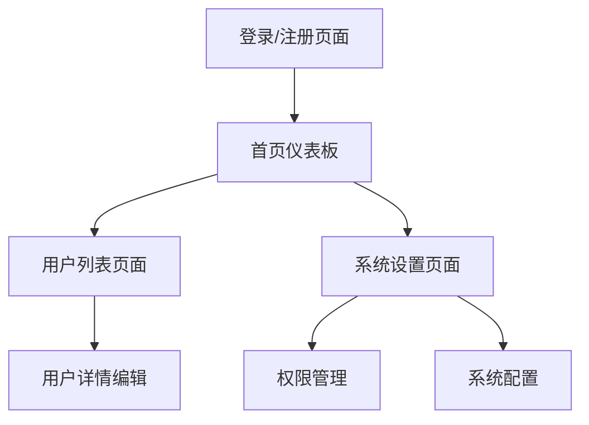

# 用户管理系统产品需求文档

## 1. Product Overview

本项目是一个基于邮箱验证码登录的用户管理系统，为管理员提供安全的用户管理和系统配置功能。

- 解决传统密码登录的安全隐患，通过邮箱验证码提供更安全便捷的身份认证方式。
- 目标用户为企业管理员和系统运维人员，提供现代化的管理界面和完善的用户管理功能。

## 2. Core Features

### 2.1 User Roles

| Role       | Registration Method | Core Permissions                               |
| ---------- | ------------------- | ---------------------------------------------- |
| 超级管理员 | 系统初始化创建      | 完整系统管理权限，用户管理，系统配置，数据管理 |
| 管理员     | 超级管理员邀请      | 用户管理，基础系统配置，数据查看               |
| 普通用户   | 邮箱验证码注册      | 个人信息管理，基础功能使用                     |

### 2.2 Feature Module

我们的用户管理系统包含以下主要页面：

1. **登录/注册页面**：邮箱验证码登录，新用户注册，密码重置功能。
2. **首页仪表板**：系统概览，用户统计，最近活动，快捷操作入口。
3. **用户列表页面**：用户管理，用户搜索过滤，批量操作，用户状态管理。
4. **系统设置页面**：系统配置，邮件服务设置，安全策略配置。

### 2.3 Page Details

| Page Name     | Module Name    | Feature description                              |
| ------------- | -------------- | ------------------------------------------------ |
| 登录/注册页面 | 邮箱验证码登录 | 输入邮箱发送验证码，验证码登录，自动登录状态保持 |
| 登录/注册页面 | 用户注册       | 邮箱验证码注册，用户信息填写，账户激活           |
| 登录/注册页面 | 密码重置       | 通过邮箱重置密码，验证码验证，新密码设置         |
| 首页仪表板    | 数据概览       | 用户总数统计，活跃用户数，系统状态监控           |
| 首页仪表板    | 快捷操作       | 常用功能入口，系统通知，最近操作记录             |
| 用户列表页面  | 用户管理       | 用户列表展示，分页查询，用户信息编辑             |
| 用户列表页面  | 搜索过滤       | 按邮箱、姓名、状态搜索，高级筛选条件             |
| 用户列表页面  | 批量操作       | 批量启用/禁用用户，批量删除，数据导出            |
| 系统设置页面  | 系统配置       | 系统参数设置，邮件服务配置，安全策略             |
| 系统设置页面  | 权限管理       | 角色权限配置，功能模块权限分配                   |

## 3. Core Process

**用户注册流程：**

1. 用户输入邮箱地址申请注册
2. 系统发送验证码到用户邮箱
3. 用户输入验证码完成邮箱验证
4. 填写基本信息完成注册
5. 账户激活，可正常登录使用

**用户登录流程：**

1. 用户输入已注册的邮箱地址
2. 系统发送登录验证码
3. 用户输入验证码完成身份验证
4. 登录成功，进入系统首页

**管理员操作流程：**

1. 管理员登录系统查看用户统计
2. 通过用户列表管理系统用户
3. 在系统设置中配置系统参数
4. 监控系统运行状态和安全日志

## 4. User Interface Design

### 4.1 Design Style

- **主色调**：深蓝色 (#1E40AF) 作为主色，浅蓝色 (#3B82F6) 作为辅助色
- **按钮样式**：现代圆角按钮，悬停渐变效果，阴影层次
- **字体**：Inter 字体系列，标题 18-28px，正文 14-16px，辅助文字 12px
- **布局风格**：卡片式设计，左侧导航栏，顶部面包屑，响应式网格布局
- **图标风格**：使用 Heroicons 图标库，线性和填充图标结合使用

### 4.2 Page Design Overview

| Page Name     | Module Name | UI Elements                                              |
| ------------- | ----------- | -------------------------------------------------------- |
| 登录/注册页面 | 验证码登录  | 居中表单卡片，渐变背景，输入框图标，倒计时按钮，加载动画 |
| 首页仪表板    | 数据概览    | 统计卡片网格，图表组件，进度条，状态指示器               |
| 用户列表页面  | 用户管理    | 数据表格，搜索栏，筛选器，分页组件，操作按钮组           |
| 系统设置页面  | 配置管理    | 选项卡导航，表单组件，开关按钮，确认对话框               |

### 4.3 Responsiveness

系统采用移动优先的响应式设计，支持桌面、平板和手机端完美适配，针对触摸操作优化交互体验，确保在各种设备上的一致性和可用性。
