# 用户管理系统技术架构文档

## 1. Architecture design

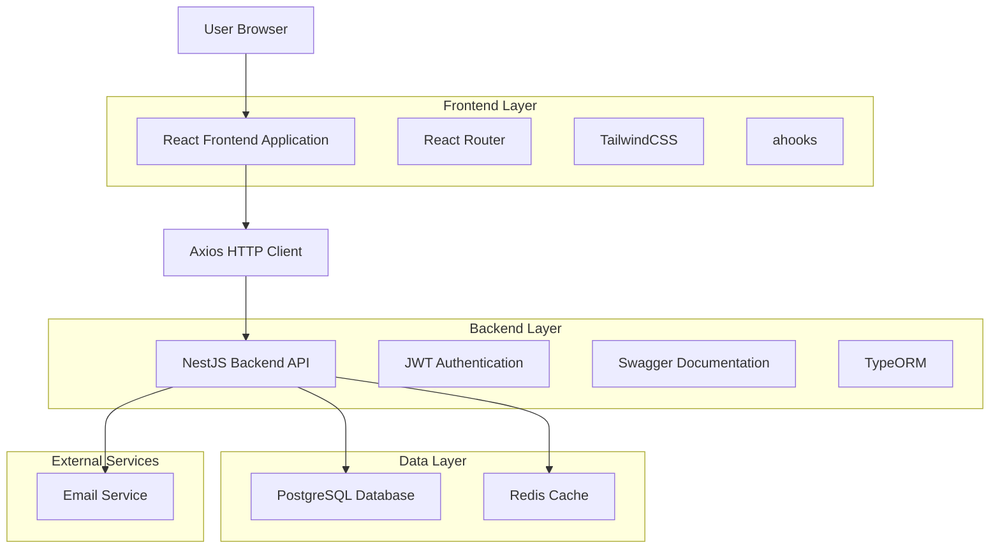

## 2. Technology Description

* **Frontend**: React\@19 + TypeScript\@5 + TailwindCSS\@3 + ahooks\@3 + axios\@1 + Vite\@5

* **Backend**: NestJS\@10 + TypeScript\@5 + TypeORM\@0.3 + Swagger\@7

* **Database**: PostgreSQL\@15 + Redis\@7 (缓存)

* **Authentication**: JWT + 邮箱验证码

* **Email Service**: Nodemailer + SMTP

* **Security**: bcrypt密码加密 + helmet安全头 + rate-limiting

## 3. Route definitions

| Route      | Purpose                            |
| ---------- | ---------------------------------- |
| /login     | 登录页面，邮箱验证码登录和用户注册 |
| /dashboard | 首页仪表板，系统概览和数据统计     |
| /users     | 用户列表页面，用户管理和搜索功能   |
| /users/:id | 用户详情页面，用户信息编辑         |
| /settings  | 系统设置页面，系统配置和权限管理   |
| /profile   | 个人资料页面，个人信息管理         |
| /404       | 404错误页面                        |

## 4. API definitions

### 4.1 Core API

**用户认证相关**

```
POST /api/auth/send-code
```

Request:

| Param Name | Param Type | isRequired | Description                       |
| ---------- | ---------- | ---------- | --------------------------------- |
| email      | string     | true       | 用户邮箱地址                      |
| type       | string     | true       | 验证码类型 (login/register/reset) |

Response:

| Param Name | Param Type | Description        |
| ---------- | ---------- | ------------------ |
| success    | boolean    | 发送状态           |
| message    | string     | 响应消息           |
| expireTime | number     | 验证码过期时间(秒) |

Example:

```json
{
  "email": "user@yourdomain.com",
  "type": "login"
}
```

```
POST /api/auth/verify-code
```

Request:

| Param Name | Param Type | isRequired | Description  |
| ---------- | ---------- | ---------- | ------------ |
| email      | string     | true       | 用户邮箱地址 |
| code       | string     | true       | 验证码       |
| type       | string     | true       | 验证类型     |

Response:

| Param Name   | Param Type | Description |
| ------------ | ---------- | ----------- |
| success      | boolean    | 验证状态    |
| token        | string     | JWT访问令牌 |
| refreshToken | string     | 刷新令牌    |
| user         | object     | 用户信息    |

**用户管理相关**

```
GET /api/users
```

Query Parameters:

| Param Name | Param Type | isRequired | Description      |
| ---------- | ---------- | ---------- | ---------------- |
| page       | number     | false      | 页码，默认1      |
| limit      | number     | false      | 每页数量，默认10 |
| search     | string     | false      | 搜索关键词       |
| status     | string     | false      | 用户状态筛选     |

Response:

| Param Name | Param Type | Description |
| ---------- | ---------- | ----------- |
| data       | array      | 用户列表    |
| total      | number     | 总数量      |
| page       | number     | 当前页码    |
| limit      | number     | 每页数量    |

```
POST /api/users
```

Request:

| Param Name | Param Type | isRequired | Description |
| ---------- | ---------- | ---------- | ----------- |
| email      | string     | true       | 邮箱地址    |
| name       | string     | true       | 用户姓名    |
| role       | string     | false      | 用户角色    |

```
PUT /api/users/:id
```

Request:

| Param Name | Param Type | isRequired | Description |
| ---------- | ---------- | ---------- | ----------- |
| name       | string     | false      | 用户姓名    |
| status     | string     | false      | 用户状态    |
| role       | string     | false      | 用户角色    |

```
DELETE /api/users/:id
```

**系统设置相关**

```
GET /api/settings
```

Response:

| Param Name     | Param Type | Description  |
| -------------- | ---------- | ------------ |
| emailConfig    | object     | 邮件服务配置 |
| securityConfig | object     | 安全策略配置 |
| systemConfig   | object     | 系统参数配置 |

```
PUT /api/settings
```

Request:

| Param Name     | Param Type | isRequired | Description  |
| -------------- | ---------- | ---------- | ------------ |
| emailConfig    | object     | false      | 邮件服务配置 |
| securityConfig | object     | false      | 安全策略配置 |
| systemConfig   | object     | false      | 系统参数配置 |

## 5. Server architecture diagram

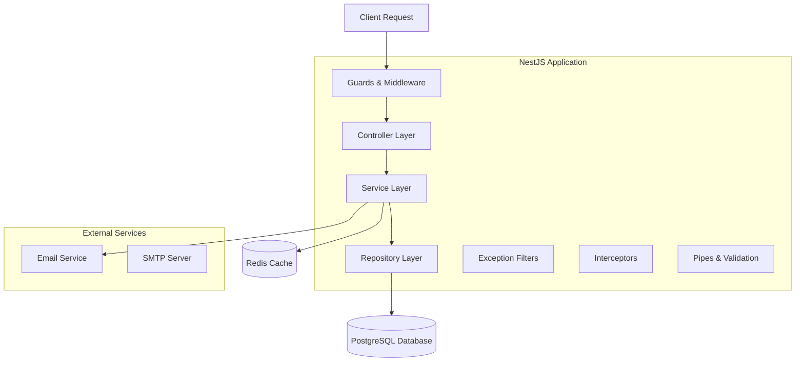

### 5.1 架构层次说明

**请求处理流程：**

1. **Guards & Middleware**: 身份验证、权限检查、请求预处理
2. **Controller Layer**: 路由处理、请求参数解析、响应格式化
3. **Service Layer**: 业务逻辑处理、数据验证、事务管理
4. **Repository Layer**: 数据访问抽象、ORM操作、查询优化
5. **Database Layer**: 数据持久化、索引优化、事务支持

**横切关注点：**

* **Exception Filters**: 全局异常处理、错误日志记录
* **Interceptors**: 请求/响应拦截、日志记录、性能监控
* **Pipes & Validation**: 数据验证、类型转换、参数清理

## 6. 安全架构设计

### 6.1 身份认证机制

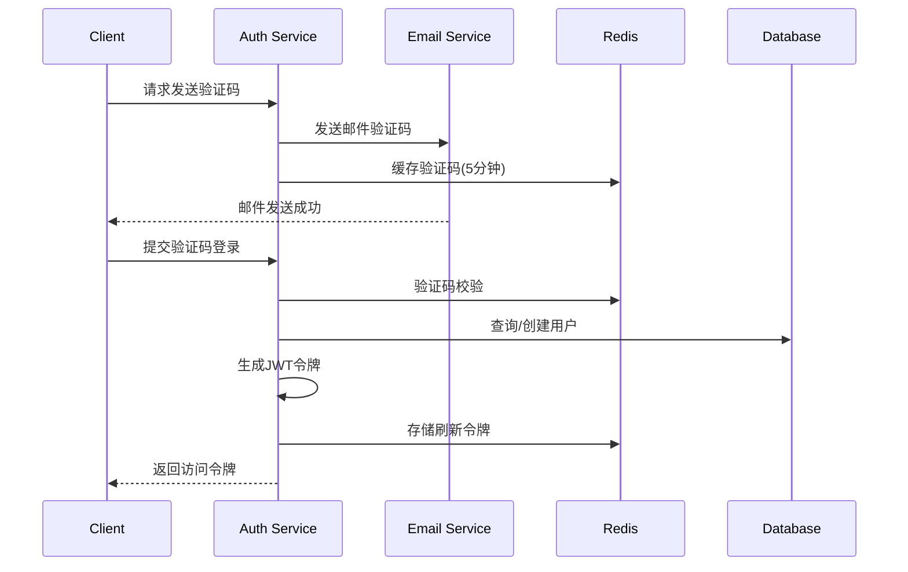

**安全特性：**

* JWT访问令牌（短期有效，1小时）
* 刷新令牌（长期有效，7天）
* 验证码限制（5分钟有效，单次使用）
* IP地址记录和异常检测
* 登录失败次数限制

### 6.2 权限控制系统

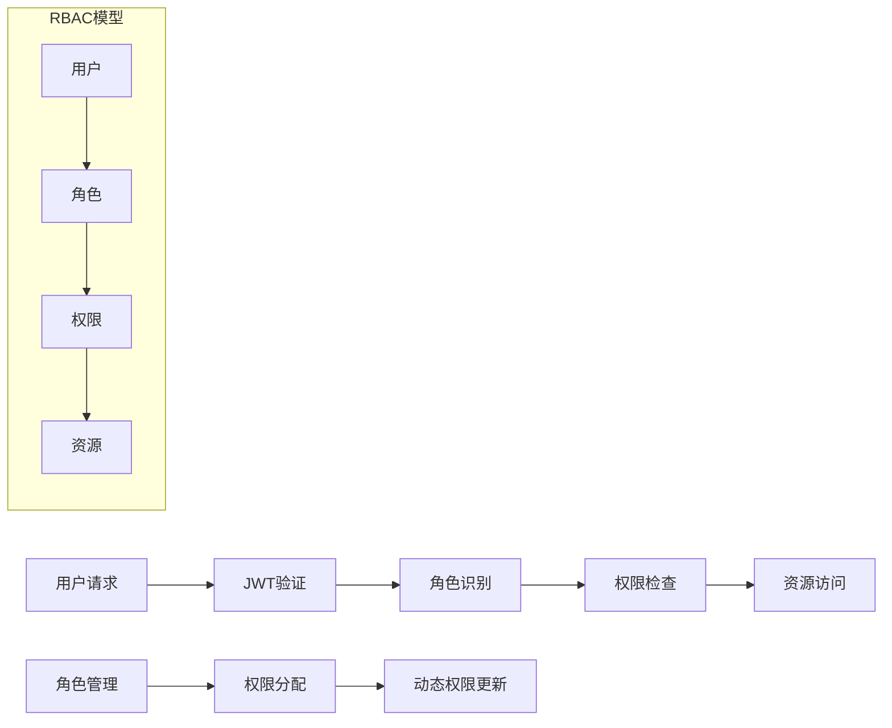

**权限模型：**

* 基于角色的访问控制（RBAC）
* 细粒度权限控制（资源+操作）
* 动态权限更新
* 权限继承和组合

### 6.3 数据安全措施

* **数据加密**: 敏感数据AES加密存储
* **传输安全**: HTTPS/TLS 1.3加密传输
* **SQL注入防护**: TypeORM参数化查询
* **XSS防护**: 输入验证和输出编码
* **CSRF防护**: CSRF令牌验证
* **请求限制**: 基于IP的频率限制

## 7. 缓存策略设计

### 7.1 Redis缓存架构

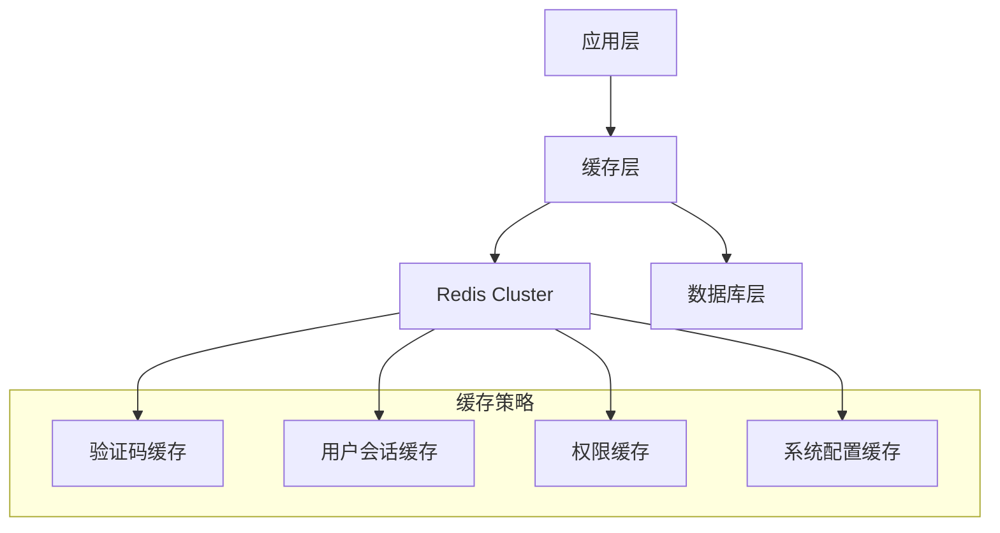

**缓存类型和策略：**

| 缓存类型   | 存储内容     | 过期时间 | 更新策略       |
| ---------- | ------------ | -------- | -------------- |
| 验证码缓存 | 邮箱验证码   | 5分钟    | 写入时过期     |
| 用户会话   | JWT刷新令牌  | 7天      | 滑动过期       |
| 权限缓存   | 用户权限信息 | 30分钟   | 权限变更时清除 |
| 系统配置   | 系统设置参数 | 1小时    | 配置更新时清除 |
| 用户信息   | 基础用户数据 | 15分钟   | 用户更新时清除 |

### 7.2 缓存一致性保证

* **写入策略**: Write-Through（写入数据库同时更新缓存）
* **失效策略**: 数据变更时主动清除相关缓存
* **预热策略**: 系统启动时预加载热点数据
* **降级策略**: 缓存不可用时直接访问数据库

## 8. 性能优化策略

### 8.1 数据库优化

**索引策略：**

```sql
-- 用户表索引优化
CREATE INDEX CONCURRENTLY idx_users_email_status ON users(email, status);
CREATE INDEX CONCURRENTLY idx_users_role_created ON users(role_id, created_at DESC);

-- 复合索引优化查询
CREATE INDEX CONCURRENTLY idx_login_logs_user_time ON login_logs(user_id, created_at DESC);
CREATE INDEX CONCURRENTLY idx_email_codes_email_type_expires ON email_codes(email, type, expires_at);
```

**查询优化：**

* 分页查询使用游标分页
* 复杂查询使用物化视图
* 读写分离（主从复制）
* 连接池优化（最大连接数：20）

### 8.2 应用层优化

**并发处理：**

* 异步处理邮件发送
* 数据库连接池管理
* 请求队列和限流
* 批量操作优化

**内存优化：**

* 对象池复用
* 内存泄漏监控
* GC优化配置
* 缓存大小限制

### 8.3 网络优化

* **HTTP/2支持**: 多路复用和服务器推送
* **压缩算法**: Gzip/Brotli响应压缩
* **CDN加速**: 静态资源分发
* **Keep-Alive**: 连接复用

## 9. 监控和日志系统

### 9.1 日志架构

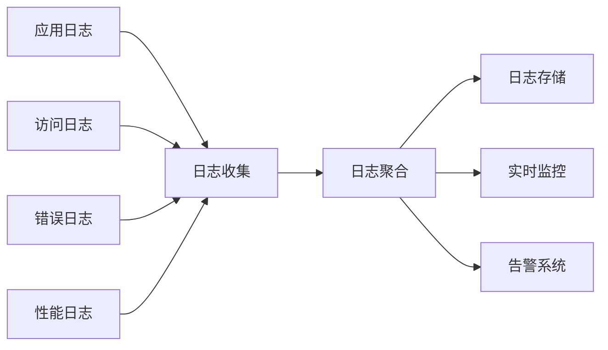

**日志分类：**

* **访问日志**: HTTP请求记录、响应时间、状态码
* **业务日志**: 用户操作、业务流程、数据变更
* **错误日志**: 异常堆栈、错误上下文、恢复建议
* **性能日志**: 数据库查询时间、缓存命中率、内存使用

### 9.2 监控指标

**系统指标：**

* CPU使用率、内存使用率
* 磁盘I/O、网络I/O
* 数据库连接数、查询响应时间
* Redis连接数、缓存命中率

**业务指标：**

* 用户注册/登录成功率
* 验证码发送成功率
* API响应时间分布
* 错误率和异常统计

### 9.3 告警策略

| 告警级别 | 触发条件                     | 通知方式       | 响应时间 |
| -------- | ---------------------------- | -------------- | -------- |
| 紧急     | 系统不可用、数据库连接失败   | 短信+邮件+电话 | 5分钟内  |
| 重要     | 错误率>5%、响应时间>2s       | 邮件+即时消息  | 15分钟内 |
| 警告     | 缓存命中率<80%、磁盘使用>80% | 邮件           | 1小时内  |
| 信息     | 新用户注册、系统配置变更     | 日志记录       | 无需响应 |

## 6. Data model

### 6.1 Data model definition

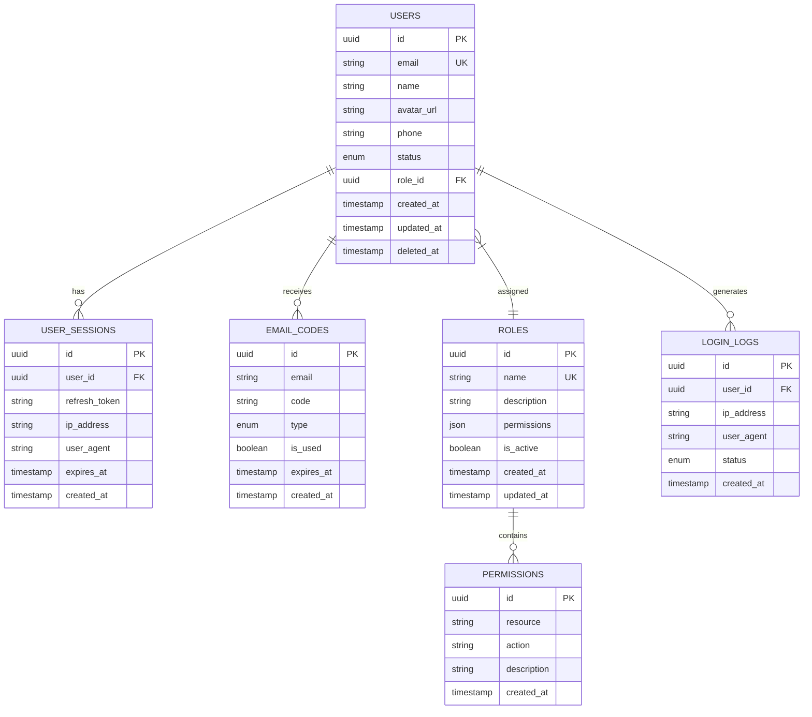

### 6.2 Data Definition Language

**用户表 (users)**

```sql
-- create table
CREATE TABLE users (
    id UUID PRIMARY KEY DEFAULT gen_random_uuid(),
    email VARCHAR(255) UNIQUE NOT NULL,
    name VARCHAR(100) NOT NULL,
    avatar_url TEXT,
    phone VARCHAR(20),
    status VARCHAR(20) DEFAULT 'active' CHECK (status IN ('active', 'inactive', 'suspended')),
    role_id UUID REFERENCES roles(id),
    created_at TIMESTAMP WITH TIME ZONE DEFAULT NOW(),
    updated_at TIMESTAMP WITH TIME ZONE DEFAULT NOW(),
    deleted_at TIMESTAMP WITH TIME ZONE
);

-- create index
CREATE INDEX idx_users_email ON users(email);
CREATE INDEX idx_users_status ON users(status);
CREATE INDEX idx_users_role_id ON users(role_id);
CREATE INDEX idx_users_created_at ON users(created_at DESC);
```

**角色表 (roles)**

```sql
-- create table
CREATE TABLE roles (
    id UUID PRIMARY KEY DEFAULT gen_random_uuid(),
    name VARCHAR(50) UNIQUE NOT NULL,
    description TEXT,
    permissions JSONB DEFAULT '{}',
    is_active BOOLEAN DEFAULT true,
    created_at TIMESTAMP WITH TIME ZONE DEFAULT NOW(),
    updated_at TIMESTAMP WITH TIME ZONE DEFAULT NOW()
);

-- create index
CREATE INDEX idx_roles_name ON roles(name);
CREATE INDEX idx_roles_is_active ON roles(is_active);

-- init data
INSERT INTO roles (name, description, permissions) VALUES
('super_admin', '超级管理员', '{"users": ["create", "read", "update", "delete"], "system": ["read", "write"], "roles": ["create", "read", "update", "delete"]}'),
('admin', '管理员', '{"users": ["create", "read", "update"], "system": ["read"]}'),
('user', '普通用户', '{"profile": ["read", "update"]}');
```

**用户会话表 (user\_sessions)**

```sql
-- create table
CREATE TABLE user_sessions (
    id UUID PRIMARY KEY DEFAULT gen_random_uuid(),
    user_id UUID REFERENCES users(id) ON DELETE CASCADE,
    refresh_token VARCHAR(500) NOT NULL,
    ip_address INET,
    user_agent TEXT,
    expires_at TIMESTAMP WITH TIME ZONE NOT NULL,
    created_at TIMESTAMP WITH TIME ZONE DEFAULT NOW()
);

-- create index
CREATE INDEX idx_user_sessions_user_id ON user_sessions(user_id);
CREATE INDEX idx_user_sessions_refresh_token ON user_sessions(refresh_token);
CREATE INDEX idx_user_sessions_expires_at ON user_sessions(expires_at);
```

**邮箱验证码表 (email\_codes)**

```sql
-- create table
CREATE TABLE email_codes (
    id UUID PRIMARY KEY DEFAULT gen_random_uuid(),
    email VARCHAR(255) NOT NULL,
    code VARCHAR(10) NOT NULL,
    type VARCHAR(20) NOT NULL CHECK (type IN ('login', 'register', 'reset')),
    is_used BOOLEAN DEFAULT false,
    expires_at TIMESTAMP WITH TIME ZONE NOT NULL,
    created_at TIMESTAMP WITH TIME ZONE DEFAULT NOW()
);

-- create index
CREATE INDEX idx_email_codes_email ON email_codes(email);
CREATE INDEX idx_email_codes_code ON email_codes(code);
CREATE INDEX idx_email_codes_expires_at ON email_codes(expires_at);
CREATE INDEX idx_email_codes_type ON email_codes(type);
```

**登录日志表 (login\_logs)**

```sql
-- create table
CREATE TABLE login_logs (
    id UUID PRIMARY KEY DEFAULT gen_random_uuid(),
    user_id UUID REFERENCES users(id) ON DELETE CASCADE,
    ip_address INET,
    user_agent TEXT,
    status VARCHAR(20) DEFAULT 'success' CHECK (status IN ('success', 'failed', 'blocked')),
    created_at TIMESTAMP WITH TIME ZONE DEFAULT NOW()
);

-- create index
CREATE INDEX idx_login_logs_user_id ON login_logs(user_id);
CREATE INDEX idx_login_logs_created_at ON login_logs(created_at DESC);
CREATE INDEX idx_login_logs_status ON login_logs(status);
```

## 10. 部署架构设计

### 10.1 容器化部署

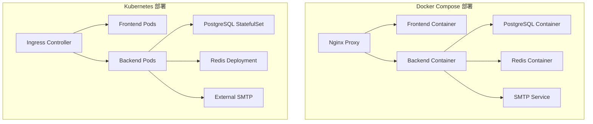

**Docker Compose 配置要点：**

* 服务隔离和网络配置
* 数据卷持久化
* 环境变量管理
* 健康检查配置
* 资源限制设置

**Kubernetes 部署特性：**

* 自动扩缩容（HPA）
* 服务发现和负载均衡
* 配置和密钥管理
* 滚动更新和回滚
* 监控和日志收集

### 10.2 生产环境架构

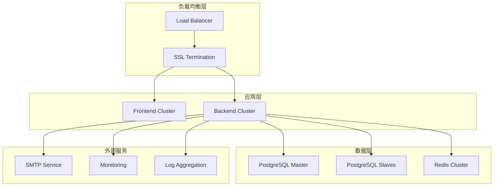

**高可用特性：**

* 多实例部署（至少2个后端实例）
* 数据库主从复制
* Redis集群模式
* 自动故障转移
* 健康检查和自愈

### 10.3 环境配置管理

| 环境       | 配置特点           | 部署方式       | 监控级别   |
| ---------- | ------------------ | -------------- | ---------- |
| 开发环境   | 单实例、本地数据库 | Docker Compose | 基础监控   |
| 测试环境   | 模拟生产、测试数据 | Kubernetes     | 完整监控   |
| 预生产环境 | 生产配置、真实数据 | Kubernetes     | 生产级监控 |
| 生产环境   | 高可用、性能优化   | Kubernetes     | 全方位监控 |

## 11. 容错和恢复机制

### 11.1 故障处理策略

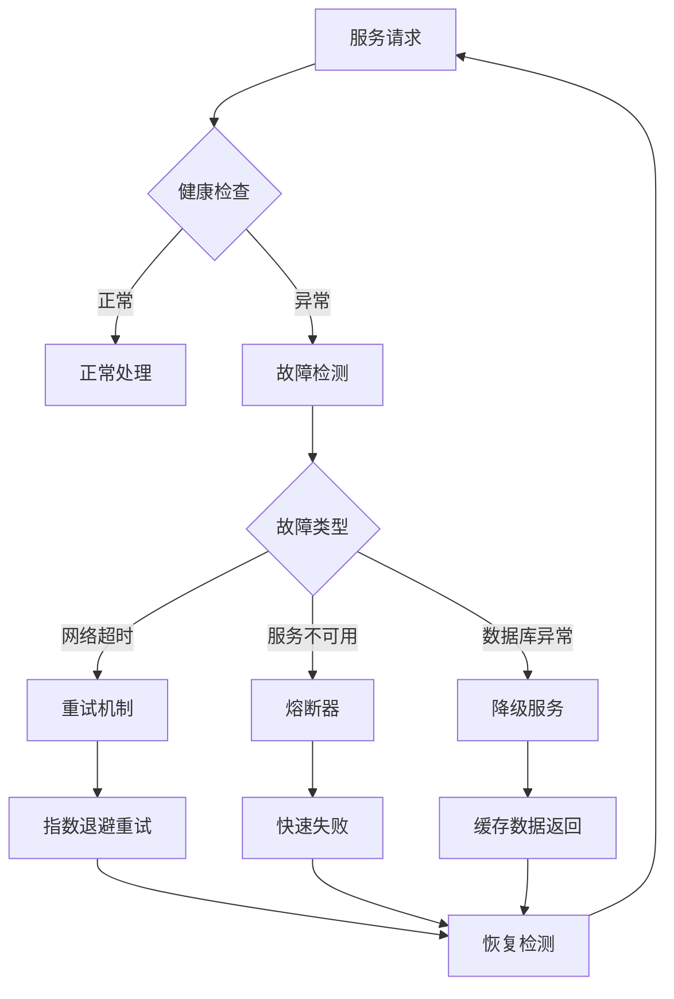

**容错机制：**

* **重试机制**: 网络异常时指数退避重试（最多3次）
* **熔断器**: 服务异常时快速失败，避免级联故障
* **超时控制**: 设置合理的请求超时时间
* **降级服务**: 核心功能不可用时提供基础服务
* **限流保护**: 防止系统过载

### 11.2 数据备份和恢复

**备份策略：**

```bash
# 数据库备份脚本
#!/bin/bash
DATE=$(date +%Y%m%d_%H%M%S)
BACKUP_DIR="/backup/postgresql"

# 全量备份（每日）
pg_dump -h localhost -U postgres -d user_management > $BACKUP_DIR/full_backup_$DATE.sql

# 增量备份（每小时）
pg_basebackup -h localhost -U postgres -D $BACKUP_DIR/incremental_$DATE -Ft -z

# 清理7天前的备份
find $BACKUP_DIR -name "*.sql" -mtime +7 -delete
```

**恢复流程：**

1. 停止应用服务
2. 恢复数据库备份
3. 验证数据完整性
4. 重启应用服务
5. 功能验证测试

### 11.3 灾难恢复计划

| 故障级别   | 恢复时间目标(RTO) | 恢复点目标(RPO) | 恢复策略      |
| ---------- | ----------------- | --------------- | ------------- |
| 应用故障   | 5分钟             | 0               | 自动重启/切换 |
| 数据库故障 | 15分钟            | 1小时           | 主从切换      |
| 机房故障   | 2小时             | 4小时           | 异地备份恢复  |
| 完全灾难   | 24小时            | 24小时          | 完整系统重建  |

## 12. 扩展性设计

### 12.1 水平扩展策略

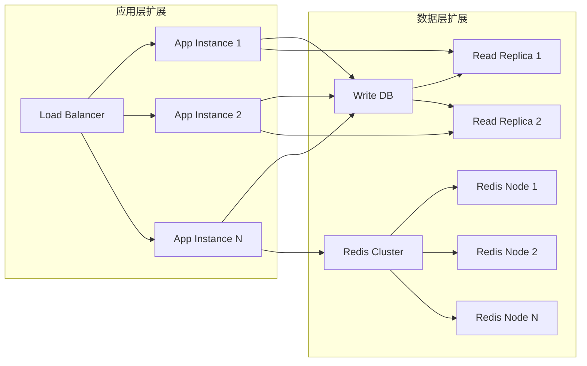

**扩展能力：**

* **无状态应用**: 支持任意数量的应用实例
* **数据库读写分离**: 读操作分散到多个从库
* **缓存集群**: Redis集群支持数据分片
* **CDN加速**: 静态资源全球分发

### 12.2 垂直扩展优化

**资源配置建议：**

| 组件     | CPU   | 内存   | 存储      | 网络    |
| -------- | ----- | ------ | --------- | ------- |
| 前端服务 | 1-2核 | 1-2GB  | 10GB      | 100Mbps |
| 后端服务 | 2-4核 | 4-8GB  | 20GB      | 1Gbps   |
| 数据库   | 4-8核 | 8-16GB | 100GB SSD | 1Gbps   |
| 缓存服务 | 2-4核 | 4-8GB  | 20GB      | 1Gbps   |

### 12.3 微服务演进路径

**当前单体架构 → 微服务架构：**

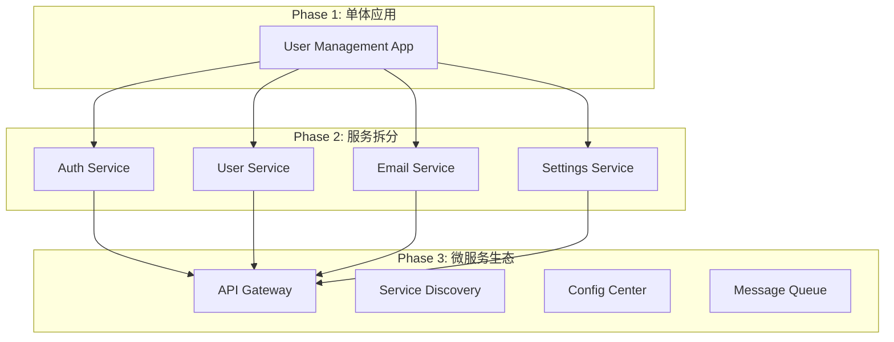

**拆分原则：**

* 按业务领域拆分服务
* 保持服务的高内聚低耦合
* 独立的数据存储
* 异步通信优先
* 统一的服务治理

## 13. 开发和运维规范

### 13.1 代码质量保证

**代码规范：**

* TypeScript严格模式
* ESLint + Prettier代码格式化
* 单元测试覆盖率 > 80%
* 集成测试覆盖核心流程
* 代码审查（Code Review）

**CI/CD流程：**

```yaml
# .github/workflows/ci.yml
name: CI/CD Pipeline

on:
  push:
    branches: [main, develop]
  pull_request:
    branches: [main]

jobs:
  test:
    runs-on: ubuntu-latest
    steps:
      - uses: actions/checkout@v3
      - name: Setup Node.js
        uses: actions/setup-node@v3
        with:
          node-version: '18'
      - name: Install dependencies
        run: npm ci
      - name: Run tests
        run: npm run test:cov
      - name: Run e2e tests
        run: npm run test:e2e
  
  build:
    needs: test
    runs-on: ubuntu-latest
    steps:
      - name: Build Docker image
        run: docker build -t user-management .
      - name: Push to registry
        run: docker push user-management:latest
  
  deploy:
    needs: build
    runs-on: ubuntu-latest
    if: github.ref == 'refs/heads/main'
    steps:
      - name: Deploy to production
        run: kubectl apply -f k8s/
```

### 13.2 运维自动化

**基础设施即代码（IaC）：**

* Terraform管理云资源
* Ansible配置管理
* Kubernetes YAML配置
* Helm Charts包管理

**监控告警自动化：**

* Prometheus + Grafana监控
* AlertManager告警管理
* 自动扩缩容（HPA/VPA）
* 日志自动分析和告警

### 13.3 安全运维

**安全扫描：**

* 依赖漏洞扫描（npm audit）
* 容器镜像安全扫描
* 代码安全扫描（SonarQube）
* 渗透测试（定期）

**访问控制：**

* 最小权限原则
* 多因素认证（MFA）
* 审计日志记录
* 定期权限审查

## 14. 技术债务和优化计划

### 14.1 当前技术债务

| 类别     | 问题描述         | 影响程度 | 优化计划         |
| -------- | ---------------- | -------- | ---------------- |
| 性能     | 数据库查询未优化 | 中等     | Q1优化索引和查询 |
| 安全     | 密码策略较弱     | 高       | Q1增强密码复杂度 |
| 可维护性 | 部分代码缺少测试 | 中等     | Q2提升测试覆盖率 |
| 扩展性   | 单体架构限制     | 低       | Q3-Q4微服务改造  |

### 14.2 技术演进路线图

**2024年路线图：**

* **Q1**: 性能优化、安全加固
* **Q2**: 测试完善、监控增强
* **Q3**: 微服务拆分准备
* **Q4**: 微服务架构实施

**长期规划：**

* 引入GraphQL API
* 实现事件驱动架构
* 机器学习集成（用户行为分析）
* 多租户支持

---

## 📚 参考资料

* [NestJS官方文档](https://nestjs.com/)
* [TypeORM文档](https://typeorm.io/)
* [PostgreSQL性能优化指南](https://www.postgresql.org/docs/)
* [Redis最佳实践](https://redis.io/documentation)
* [JWT安全最佳实践](https://tools.ietf.org/html/rfc7519)
* [Docker容器化最佳实践](https://docs.docker.com/develop/dev-best-practices/)
* [Kubernetes部署指南](https://kubernetes.io/docs/)

---

*文档版本：v2.0*  
*最后更新：2024年1月*  
*维护者：开发团队*
